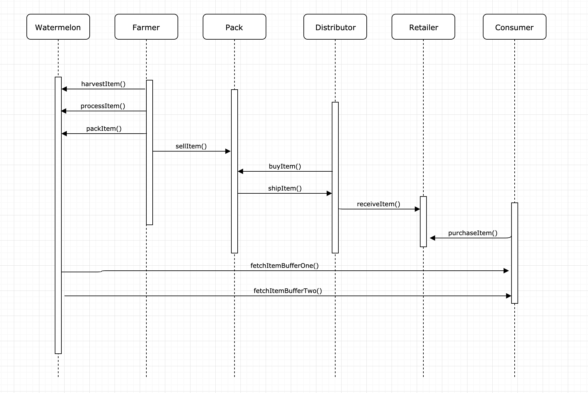

### Watermelon Supply Chain 

Watermelon supply chain solution using blockchain in Solidity

### UML Diagrams

All diagrams are in  `./UML` folder.

#### Deployment

Rinkeby transaction hash : 0x0da2e1394f6a80d948f97decca7e6c6f8a522aa267f9a9404a5ba88100eef765

Rinkeby contract address : 0x280526aB80698Ffa4FE562526552335F853256d2

https://rinkeby.etherscan.io/address/0x280526aB80698Ffa4FE562526552335F853256d2

## Compile Versions

Node version : v10.15.0
Truffle version : v5.0.36
Solidity : v0.5.8
(If you have trouble compiling solidity you can change  pragma solidity >=0.4.24; to pragma solidity ^0.5.8;)
Web3 vesrion : v1.2.1
